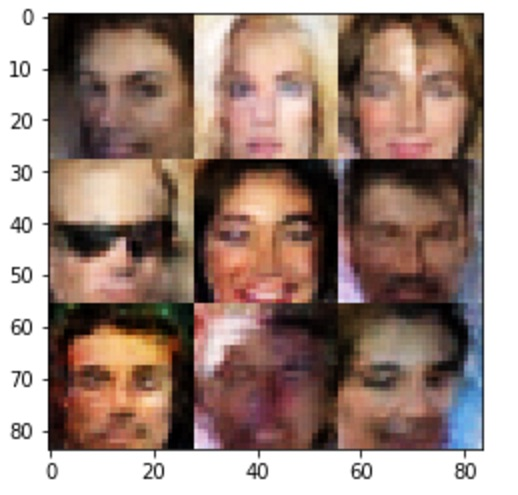

# DCGAN and Improved WGAN

Project referenced from Udacity's [face_generation](https://github.com/udacity/deep-learning/tree/master/face_generation) wich is part of their [deep-learning](https://github.com/udacity/deep-learning) course. Further implementations have been done for DCGAN and Improved WGAN with techniques to improve training speed.

### Prerequisites

- Jupyter notebook
- Tensoflow 
- Matplotlib
- Numpy

## Getting Started

1. `git clone ` + repo URL
2. cd to repo
3. `pip install -r requirement.txt` if packages are not yet installed
4. `jupyter notebook ` + jupyter notebook selected

## Results

## History

1. Generate images with DCGAN like architecture
2. Implemented improved WGAN

## Built With

* [Tensoflow](https://www.tensorflow.org) - Software library for numerical computation using data flow graphs
* [Jupyter notebook](http://jupyter.org) - Web-based notebook environment for interactive computing
* [Matplotlib](https://matplotlib.org) - Python 2D plotting library
* [Numpy](http://www.numpy.org) - package for scientific computing

## Contributing

1. Fork it! Star it?
2. Create your feature branch: `git checkout -b my-new-feature`
3. Commit your changes: `git commit -am 'Add some feature'`
4. Push to the branch: `git push origin my-new-feature`
5. Submit a pull request :D

## Authors

* **Udacity** - *Initial work/Notebook boiler plate* - [Repo](https://github.com/udacity/deep-learning/tree/master/face_generation)
* **Jorge Ceja** - *Model implementations* - [Account](https://github.com/JorgeCeja)

## Acknowledgments

* Improved Techniques for Training GANs - [arXiv](https://arxiv.org/abs/1606.03498)
* Unsupervised Representation Learning with Deep Convolutional Generative Adversarial Networks - [arXiv](https://arxiv.org/abs/1511.06434)
* Improved Training of Wasserstein GANs - [arXiv](https://arxiv.org/abs/1704.00028)
